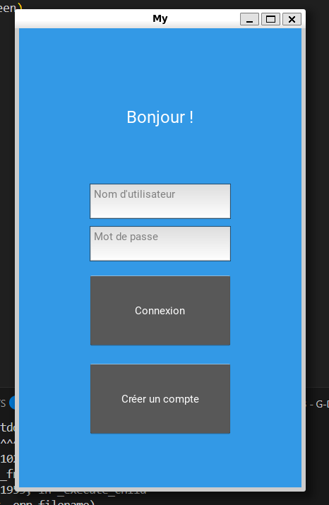
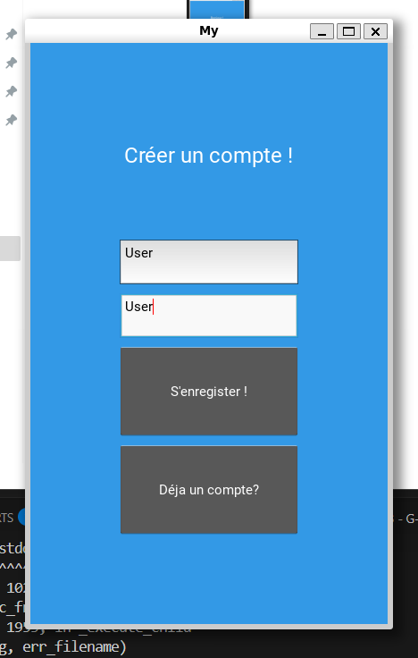
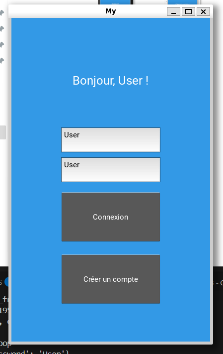

# 📝 POC Mobile – Kivy (Login / Register)

## 🎯 Objectif  
Ce projet est un **POC (Proof of Concept)** visant à tester le développement mobile avec **Python** et **Kivy**.  
L’objectif est de valider :  
- la **faisabilité** d’un système simple de **connexion / inscription**,  
- l’**ergonomie** des écrans avec Kivy,  
- la **gestion des entrées utilisateur** et la navigation entre plusieurs écrans.  

👉 Ce prototype se concentre uniquement sur la validation technique et ergonomique.  
Il n’inclut pas :  
- de sécurité avancée (ex. chiffrement des mots de passe),  
- de persistance via une base de données,  
- ni de design graphique abouti (interfaces volontairement simples).  

---

## 🚀 Pourquoi Kivy ?  
- **Framework Python** : accessible pour les développeurs Python.  
- **Multi-plateforme** : permet de créer des apps Android, iOS, Windows, Linux et macOS.  
- **Rapidité de prototypage** : quelques lignes suffisent pour générer une interface.  
- **Open-source** : actif et maintenu par une communauté engagée.  

---

## ⚖️ Benchmark – Comparaison avec d’autres solutions  

| Critère                    | **Kivy (Python)**          | **Flutter**                     | **Kotlin (Natif Android)**    |
|----------------------------|-----------------------------|---------------------------------|-------------------------------|
| **Performance**            | Faible (pas optimisée)     | Quasi native (60fps)            | Optimale (100% natif)         |
| **Temps de dev.**          | Rapide (code Python simple) | Rapide (Hot Reload)             | Plus long (Android only)      |
| **Courbe d’apprentissage** | Faible (Python connu)      | Modérée (apprendre Dart)        | Moyenne (Android SDK)         |
| **Taille APK/IPA**         | Lourde                     | 8–15 Mo                         | Plus léger                    |
| **Consommation mémoire**   | Assez élevée               | Optimisée mais plus lourde       | Optimale                      |
| **Communauté**             | Plus petite                | Large, très active              | Stable et mature              |
| **Plugins & intégration**  | Limité                     | Riche (pub.dev)                 | 100% supporté par l’OS        |

👉 **Conclusion rapide** : Kivy est idéal pour apprendre et prototyper rapidement, mais limité pour des projets professionnels exigeants.  

---

## ✅ Points positifs
- **Facile à utiliser** : intuitif une fois installé.  
- **Code minimaliste** : rapide à prendre en main.  
- **Prototypage rapide** : quelques lignes suffisent pour un système fonctionnel.  

---

## 🚫 Points négatifs
- **Pas très agréable à coder** : `FloatLayout` rend la gestion des positions lourde.  
- **Interface basique** : pas de design travaillé.  
- **Installation fastidieuse** : dépendances nombreuses, peut varier selon l’OS.  

---

## 🛠️ Installation & Lancement  
1. Suivre la [documentation officielle](https://kivy.org/doc/stable/gettingstarted/installation.html).  
2. Créer un fichier Python (ex. `main.py`).  
3. Exécuter l’application :  
   ```bash
   python main.py

## 🚀 Demo

### Login page:



### Register page:



### Login page connexion réussie:



---

Alexandre De-Angelis
Benjamin Buisson
Enzo Petit
Hugo Dufour
Suleman Maqsood
