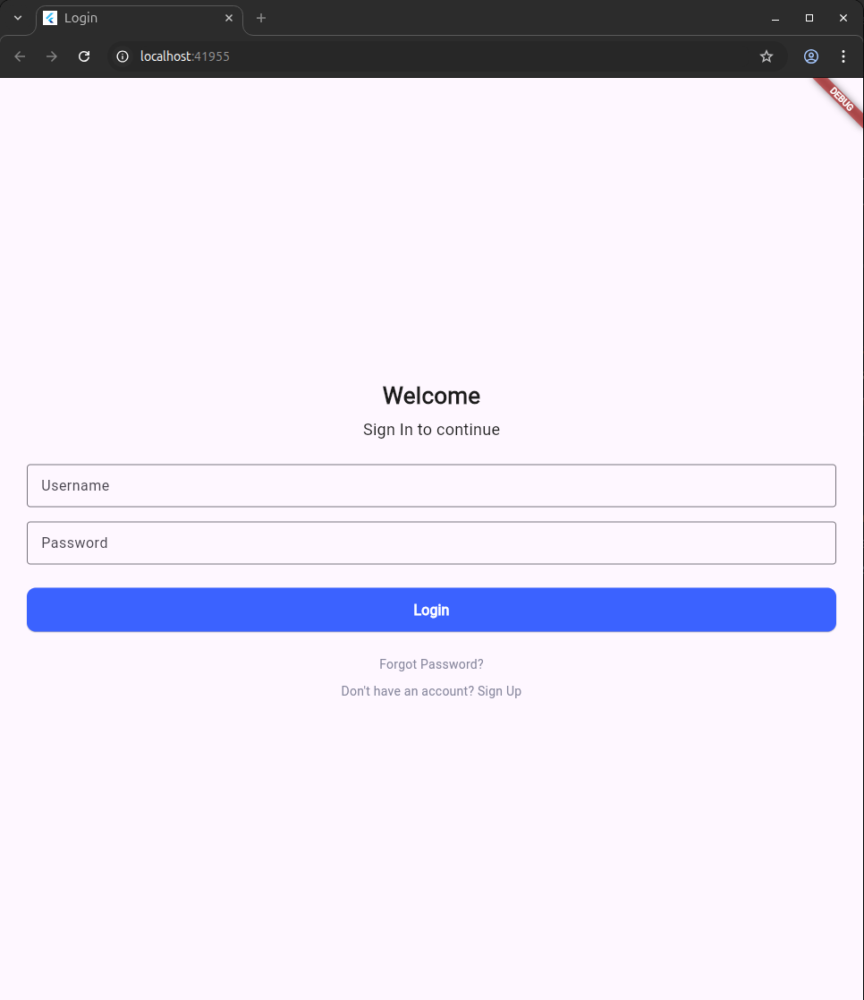
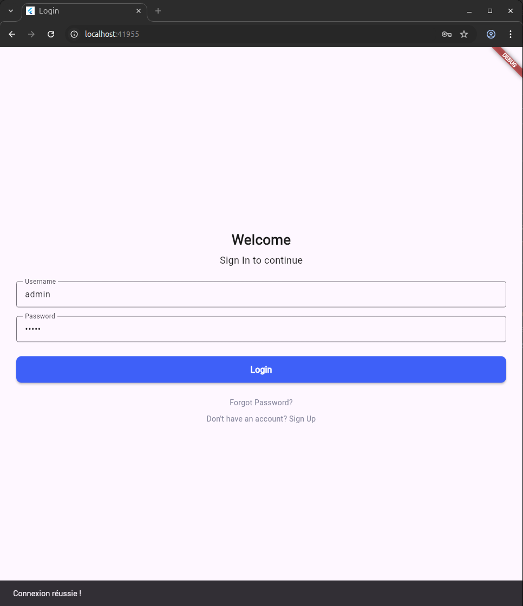

# Proof of Concept – Flutter

## 🎯 Objectif  
Ce projet est un **POC (Proof of Concept)** réalisé dans le cadre d’une étude comparative de plusieurs langages et frameworks de développement mobile.  
L’objectif est de tester Flutter, d’évaluer sa facilité de prise en main et de juger sa pertinence pour nos futurs projets.  

## 🚀 Pourquoi Flutter ?  
- **Ressemble au C** : la syntaxe est claire, agréable à lire et proche de langages que nous connaissons déjà.  
- **Facile à installer** : mise en place rapide de l’environnement de développement.  
- **Facile à démarrer** : création d’un projet et exécution d’une application en quelques commandes.  
- **Écosystème actif** : Flutter est maintenu et mis à jour régulièrement par Google.  
- **Pérennité** : une grande partie des projets mobiles modernes sont développés en Flutter, ce qui en fait une compétence précieuse pour l’avenir.  

## ⚖️ Benchmark – Comparaison avec d’autres solutions

| Critère                    | **Flutter**               | **React Native**                | **Natif (Kotlin/Swift)**     |
|----------------------------|---------------------------|---------------------------------|------------------------------|
| **Performance**            | Quasi native (60fps)      | Correcte, parfois bridée        | Optimale (100% natif)        |
| **Temps de dev.**          | Rapide (Hot Reload)       | Rapide (Fast Refresh)           | Plus long (2 apps séparées)  |
| **Courbe d’apprentissage** | Modérée (apprendre Dart)  | Faible (JS connu)               | Forte (2 langages, 2 SDKs)   |
| **Taille APK/IPA**         | 8–15 Mo                   | 6–12 Mo                         | Plus léger                   |
| **Consommation mémoire**   | Optimisée mais + lourde   | Moyenne                         | Optimale                     |
| **Communauté**             | Large, très active        | Très large                      | Stable mais cloisonnée       |
| **Plugins & intégration**  | Riche (pub.dev)           | Nombreux mais parfois instables | 100% supporté par l’OS       |

👉 **Conclusion rapide** : Flutter offre le meilleur compromis **temps de développement / performance**. Seul le natif fait mieux en performances brutes, mais au prix d’un coût de dev plus élevé.  

## Points Négatifs
 - Nouvel apprentissage : Flutter utilise le langage Dart, qu’il faut apprendre avant de pouvoir pleinement l’exploiter.
 - Moins de maturité que le natif : certaines nouveautés propres à Android ou iOS peuvent mettre un peu plus de temps à être disponibles sur Flutter.
 (Exemple → lorsqu’Apple a introduit Face ID ou App Clips, ou quand Android a lancé les bulles de notifications (Chat Heads style Messenger), Flutter a mis un certain temps à proposer des plugins officiels ou communautaires pour en tirer parti.)

## 🛠️ Installation & Lancement  
1. Installer Flutter : [Documentation officielle](https://docs.flutter.dev/get-started/install)  
2. Vérifier l’installation :  
   ```bash
   flutter doctor
   ```  
3. Créer un nouveau projet (optionnel si déjà cloné) :  
   ```bash
   flutter create poc_flutter
   ```  
4. Lancer l’application :  
   ```bash
   flutter run
   ```  

## 📂 Structure du projet  
Le projet contient :  
- `main.dart` : point d’entrée de l’application  
- `register.dart` : écran de gestion d’inscription  

## 🚀 Demonstration

 ### Écran de connexion  
  

 ### Écran de connexion réussie  
 

 ### Écran de creation de compte  
 

## ✅ Conclusion  
Flutter s’est révélé être un framework :  
- **simple à apprendre**,  
- **efficace à utiliser**,  
- et **prometteur pour l’avenir**.  

Au vu de notre expérience avec ce POC, nous pensons que **Flutter serait le meilleur choix pour nos projets futurs professionnels**, car c’est aujourd’hui l’un des frameworks **les plus demandés sur le marché**.  
C’est donc celui que nous utiliserons pour **AREA**.  

---

Alexandre De-Angelis
Benjamin Buisson
Enzo Petit
Hugo Dufour
Suleman Maqsood
