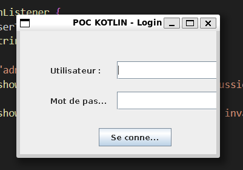
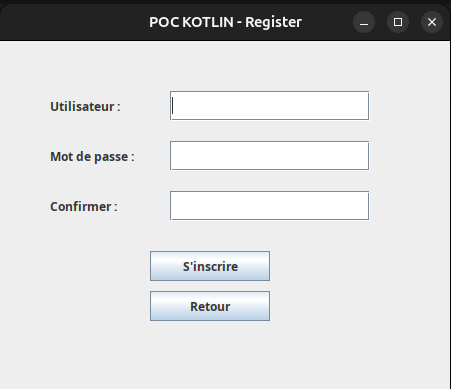
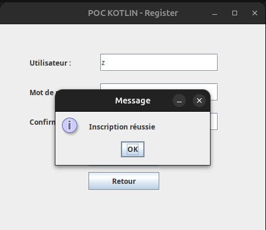

# 📝 POC MOBILE: Kotlin Système de Login / Register

## 📖 Description

**POC (Proof of Concept)** d’un système de **connexion / inscription** réalisé avec **Kotlin**.  
L’application propose deux écrans :
- **Login** : permettre à un utilisateur de se connecter.  
- **Register** : créer un nouveau compte utilisateur.  

L’objectif est de voir comment fonctionne Kotlin pour la réalisation d’une application mobile, à travers 3 axes principaux :
- Validation de la faisabilité d’un système login/register simple.  
- Tester l’ergonomie des écrans avec Kotlin.  
- Vérifier la gestion des entrées utilisateur et la navigation entre écrans.
  
Portée du POC : 

Ce prototype se concentre uniquement sur la validation technique et l’ergonomie.
Il n’inclut pas :
- De mécanismes de sécurité (ex. chiffrement des mots de passe),
- De persistance des données via une base de données,
- Ni de design graphique abouti (interface volontairement basique).

---

## ✅ Points positifs

- **Facile à utiliser** : une fois installé, l’application est intuitive.  
- **Code minimaliste** : facile pour apprendre les bases de Kotlin.  
- **Rapide à mettre en place** : peu de lignes suffisent pour obtenir un système fonctionnel.  

---

## 🚫 Points négatifs

- **Pas très agréable à coder** : `FloatLayout` rend la gestion des positions lourde et répétitive.  
- **Pas très beau** : l’interface graphique reste très basique, sans design travaillé.  
- **Installation fastidieuse** : Kivy nécessite plusieurs dépendances, ce qui peut compliquer l’installation selon l’environnement.  

---

## Test 

 - kotlinc test.kt -include-runtime -d test.jar
 - java -jar test.jar

---
## 🚀 Demo

### Login page:

### Login page connexion réussie:

### Register page:

### Register:

---

## 🚀 Installation

https://kotlinlang.org/docs/command-line.html#manual-install

---

Alexandre De-Angelis
Benjamin Buisson
Enzo Petit
Hugo Dufour
Suleman Maqsood
